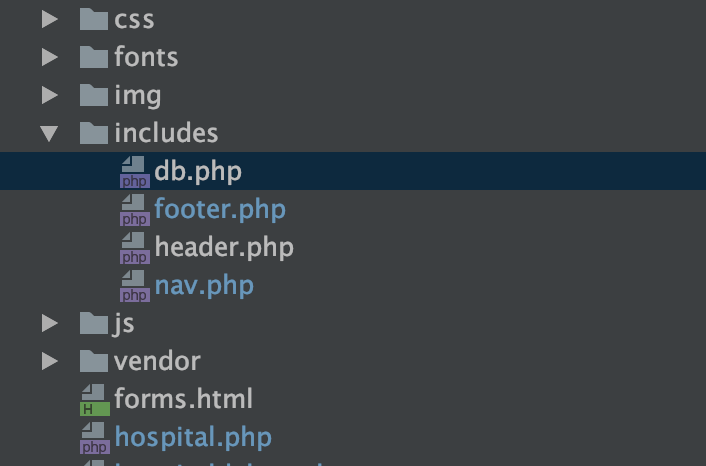
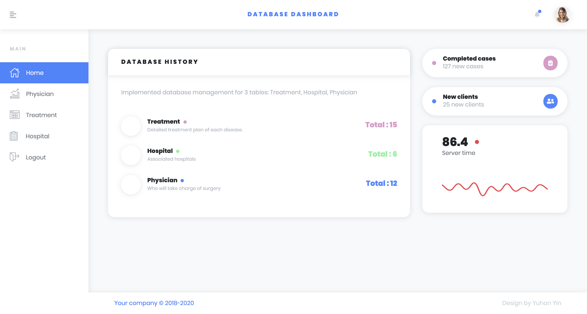
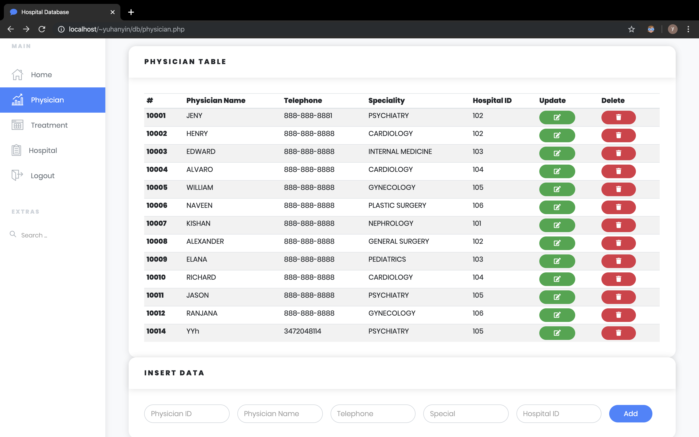
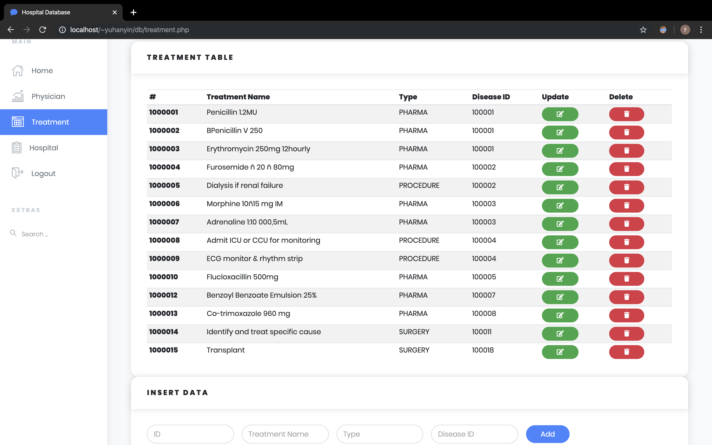
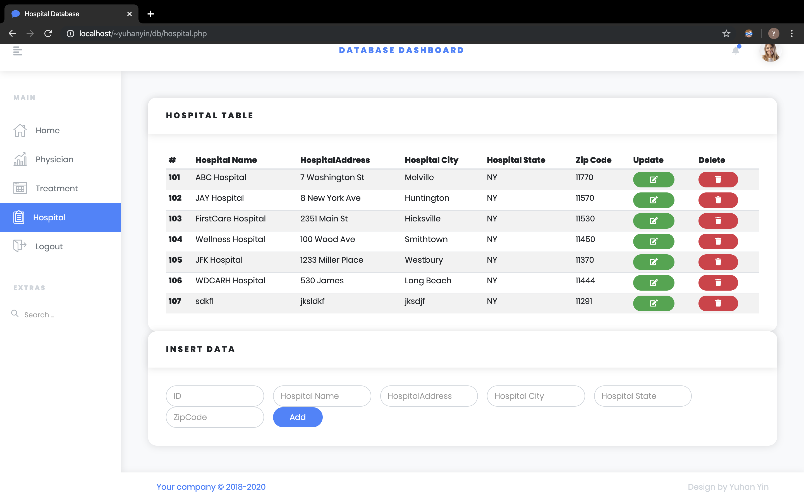
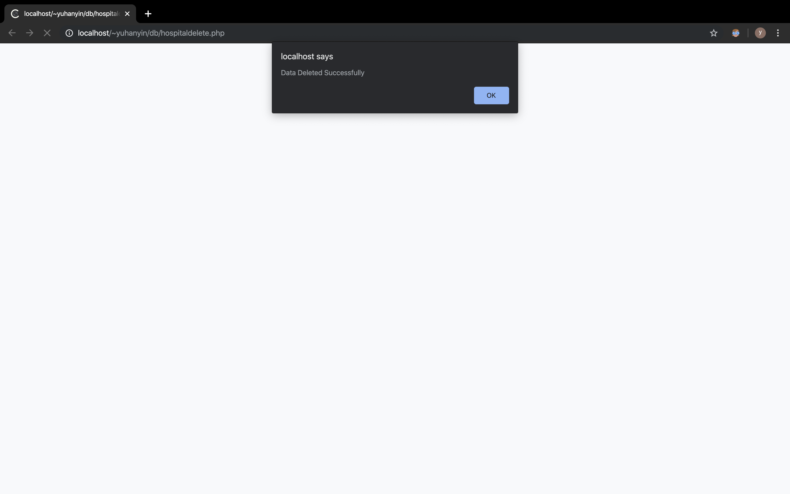
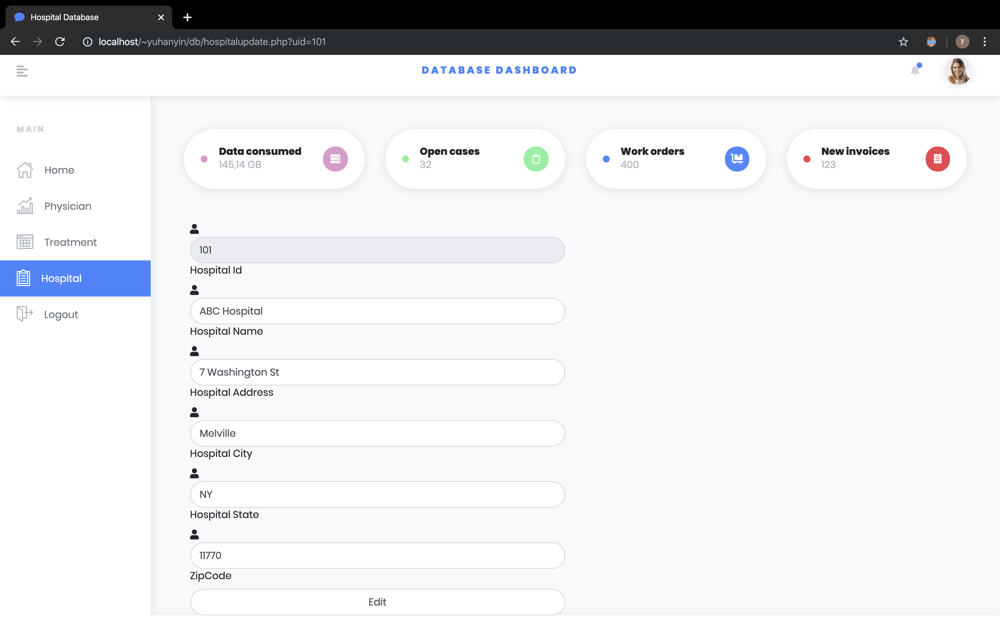
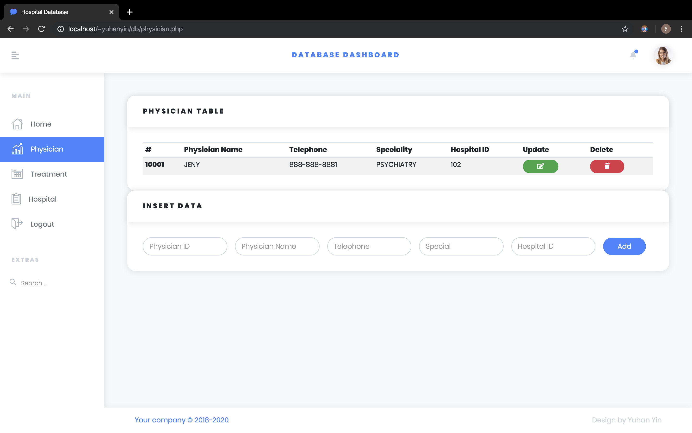

# Project 

**Yuhan Yin **

30th November

------

# SECTION

#### [A) section A](#section-a)

​	Web application,  framework/programming, features, and functionality 

#### [B) section B](#section-b)

​	DDL


------

### Section C

- #### Environment
  - PHP
  - MySQL
  - XAMPP
  - HTML


- #### Fuctionality
  - create views for three tables: Physician, Treatment, Hospital.
  - dynamically **insert/update/delete** the data in the database.
    - check insert/update data with "is_numeric()" "test_input()" function
    - check delete data whether is parent key 
  - **Search** data in tables.
  - Allow **Users login**.
  - User-friendly Interface with elegant UI.

- #### Implementation


- - Package Structrue

    extract db.php, footer.php, header.php, nav.php to reduce duplicate code

    

  - Database connection

    ```php
    $host= "127.0.0.1";
    $user= "root";
    $pass="";
    $database="F196083B";

    $db= new mysqli($host,$user,$pass,$database);
    // check every connection is successful or not
    ```

    ​

  - Data transfer in PHP

    ```php+html
    <!--   Use name to get value from input -->
    <input name="PhyName" type="text" value="<?php    echo $PhyName ?>" placeholder="Physician Name">

    <!--  PHP get value and 'query' to database -->
    <?php
    if( isset($_POST['submit'])){

        $id = test_input($_POST['ID']);
        $PhyName= test_input( $_POST['PhyName']);
    	.
        .
        $sql= "INSERT INTO physician VALUES ($id,'$PhyName' ,'$Tel' ,'$Spe','$HID' ) ";
        if($db->query($sql)== TRUE){
        .
        .
    ?> 
    ```


- #### Screenshots

  Homepage

  

  Login page

  

  Three table view

  

  

  

  Insert delete update

  

  

search



------

### SECTION B

#### DDL statement

```sql
-- principal of database 
-- yuhan yin yy3030 N11055969
-- database F196083B 
-- mysql version
-- 2019-11-14 

CREATE DATABASE IF NOT EXISTS F196083B DEFAULT CHARSET = utf8;
USE F196083B;

DROP TABLE IF EXISTS department;
CREATE TABLE department (
    did     TINYINT NOT NULL COMMENT 'ID OF DEPARTMENT',
    dname   VARCHAR(20) NOT NULL COMMENT 'NAME OF DEPARTMENT',
    dtel    VARCHAR(13) NOT NULL COMMENT 'TEL OF DEPARTMNET',
    hid     SMALLINT NOT NULL COMMENT 'HOSPITAL ID OF DEPARTMENT'
);

ALTER TABLE department ADD CONSTRAINT department_pk PRIMARY KEY ( did );


DROP TABLE IF EXISTS disease;
CREATE TABLE disease (
    deid     VARCHAR(6) NOT NULL COMMENT ' ID OF DISEASE',
    dename   VARCHAR(30) NOT NULL COMMENT 'NAME OF DISEASE'
);

ALTER TABLE disease ADD CONSTRAINT disease_pk PRIMARY KEY ( deid );

DROP TABLE IF EXISTS hospital;
CREATE TABLE hospital (
    hid           SMALLINT NOT NULL COMMENT 'ID OF HOSPITAL',
    hname         VARCHAR(30) NOT NULL COMMENT 'NAME OF HOSPITAL',
    hst_address   VARCHAR(30) NOT NULL COMMENT 'ADDRESS OF HOSPITAL',
    hst_city      VARCHAR(30) NOT NULL COMMENT 'city of hospital',
    hstate        VARCHAR(20) NOT NULL COMMENT 'STATE OF HOSPITAL',
    hzip          INT NOT NULL COMMENT 'ZIPCODE OF HOSPITAL'
);

ALTER TABLE hospital ADD CONSTRAINT hospital_pk PRIMARY KEY ( hid );


DROP TABLE IF EXISTS patient;
CREATE TABLE patient (
    pid       BIGINT NOT NULL COMMENT 'ID OF PATIENT',
    pfname    VARCHAR(30) NOT NULL COMMENT 'FIRST NAME OF PATIENT',
    plname    VARCHAR(20) NOT NULL COMMENT 'LAST NAME OF PATIENT',
    pgender   CHAR(1) NOT NULL COMMENT 'GENDER OF PATIENT',
    pbd       DATETIME NOT NULL COMMENT 'BIRTH DATE OF PATIENT',
    prace     VARCHAR(20) COMMENT 'RACE OF PATIENT',
    pstatus   CHAR(1) NOT NULL COMMENT 'STATUS OF PATIENT'
);

ALTER TABLE patient ADD CONSTRAINT patient_pk PRIMARY KEY ( pid );


DROP TABLE IF EXISTS patient_treatment;
CREATE TABLE patient_treatment (
    tdate     DATETIME NOT NULL COMMENT 'DATE OF TREATMENT',
    tfreq     BIGINT NOT NULL COMMENT 'FREQUENCY OF PATIENT TREATMENT',
    tstatus   CHAR(1) NOT NULL COMMENT 'STATUS OF PATIENT TREATMENT',
    pid       BIGINT NOT NULL COMMENT 'PATIENT ID OF PATIENT TREATMENT',
    tid       BIGINT NOT NULL COMMENT 'TREATMENT ID OF PATIENT TREATMENT',
    phid      INT NOT NULL COMMENT 'PHSICIAN ID OF PATIENT TREATMENT'
);

ALTER TABLE patient_treatment
    ADD CONSTRAINT patient_treatment_pk PRIMARY KEY ( tdate,
                                                      tfreq,
                                                      pid,
                                                      tid,
                                                      phid );

DROP TABLE IF EXISTS physician;
CREATE TABLE physician (
    phid      INT NOT NULL COMMENT 'ID OF PHYSICIAN',
    phfname   VARCHAR(30) NOT NULL COMMENT 'FIRST NAME OF PHYSICIAN',
    phtel     VARCHAR(13) NOT NULL COMMENT 'TEL OF PHYSICIAN',
    phspl     VARCHAR(30) NOT NULL COMMENT 'SPECIAL OF PHYSICIAN',
    hid       SMALLINT NOT NULL COMMENT 'HOSPITAL ID OF PHYSICIAN'
);

ALTER TABLE physician ADD CONSTRAINT physician_pk PRIMARY KEY ( phid );


DROP TABLE IF EXISTS treatment;
CREATE TABLE treatment (
    tid     BIGINT NOT NULL COMMENT 'ID OF TREATMENT',
    tname   VARCHAR(50) NOT NULL COMMENT 'NAME OF TREATMENT',
    ttype   VARCHAR(10) NOT NULL COMMENT 'TYPE OF TREATMENT',
    deid    VARCHAR(6) NOT NULL COMMENT 'DISEASE ID OF TREATMENT'
);

ALTER TABLE treatment ADD CONSTRAINT treatment_pk PRIMARY KEY ( tid );


DROP TABLE IF EXISTS users;
CREATE TABLE users (
    uid     SMALLINT NOT NULL COMMENT 'ID OF USER',
    ufname   VARCHAR(20) NOT NULL COMMENT 'FIRST NAME OF USER',
    ulname   VARCHAR(20) NOT NULL COMMENT 'LAST NAME OF USER',
    urole    VARCHAR(20) NOT NULL COMMENT 'ROLE OF USER',
    did      TINYINT NOT NULL COMMENT 'DEPARTMENT  ID OF USER'
);

ALTER TABLE users ADD CONSTRAINT users_pk PRIMARY KEY ( `UID` );

ALTER TABLE department
    ADD CONSTRAINT department_hospital_fk FOREIGN KEY ( hid )
        REFERENCES hospital ( hid );

ALTER TABLE patient_treatment
    ADD CONSTRAINT patient_treatment_patient_fk FOREIGN KEY ( pid )
        REFERENCES patient ( pid );

ALTER TABLE patient_treatment
    ADD CONSTRAINT patient_treatment_physician_fk FOREIGN KEY ( phid )
        REFERENCES physician ( phid );

ALTER TABLE patient_treatment
    ADD CONSTRAINT patient_treatment_treatment_fk FOREIGN KEY ( tid )
        REFERENCES treatment ( tid );

ALTER TABLE physician
    ADD CONSTRAINT physician_hospital_fk FOREIGN KEY ( hid )
        REFERENCES hospital ( hid );

ALTER TABLE treatment
    ADD CONSTRAINT treatment_disease_fk FOREIGN KEY ( deid )
        REFERENCES disease ( deid );

ALTER TABLE users
    ADD CONSTRAINT users_department_fk FOREIGN KEY ( did )
        REFERENCES department ( did );


-- constrains
ALTER TABLE PATIENT ADD CONSTRAINT CK_PATIENT_PGENDER CHECK (PGENDER IN ('M','F','U'));

ALTER TABLE PATIENT ADD CONSTRAINT CK_PATIENT_PSTATUS CHECK (PSTATUS IN ('M','S','D','W'));

ALTER TABLE PATIENT_TREATMENT ADD CONSTRAINT CK_PATIENT_TREATMENT_TSTATUS CHECK (TSTATUS IN ('S','F','R'));

ALTER TABLE TREATMENT ADD CONSTRAINT CK_TREATMENT_TTYPE CHECK (TTYPE IN ('PHARMA','PROCEDURE','SURGERY'));
```

### 